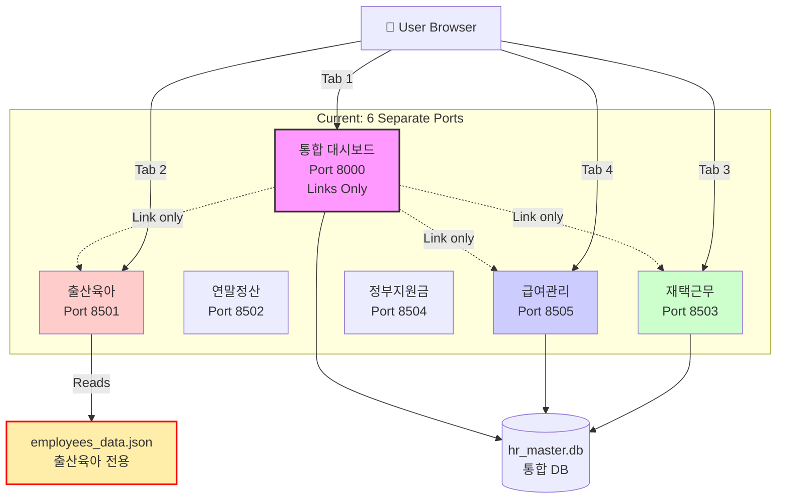
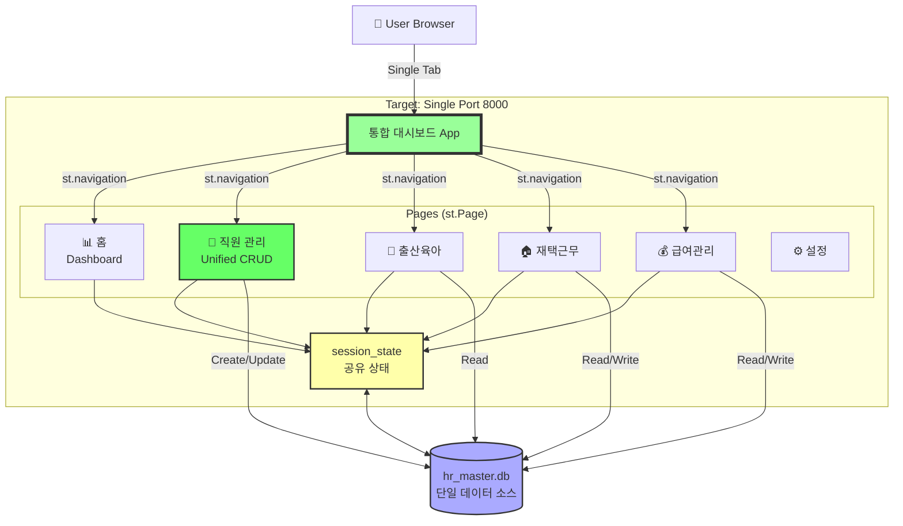
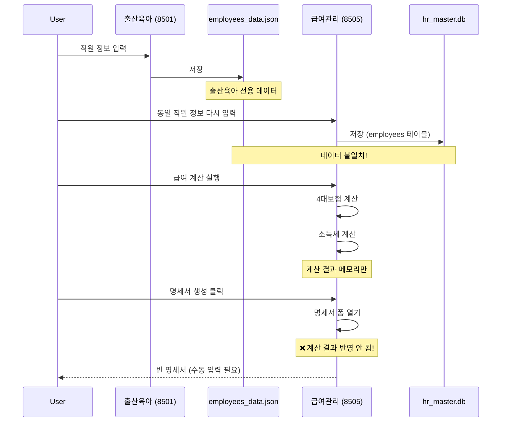
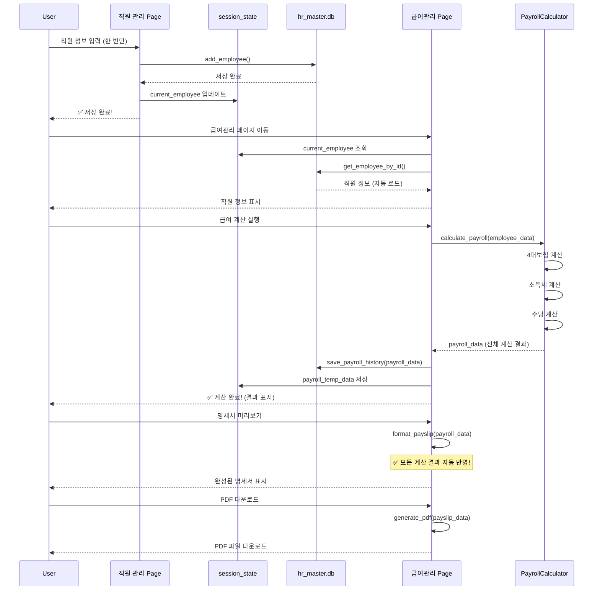
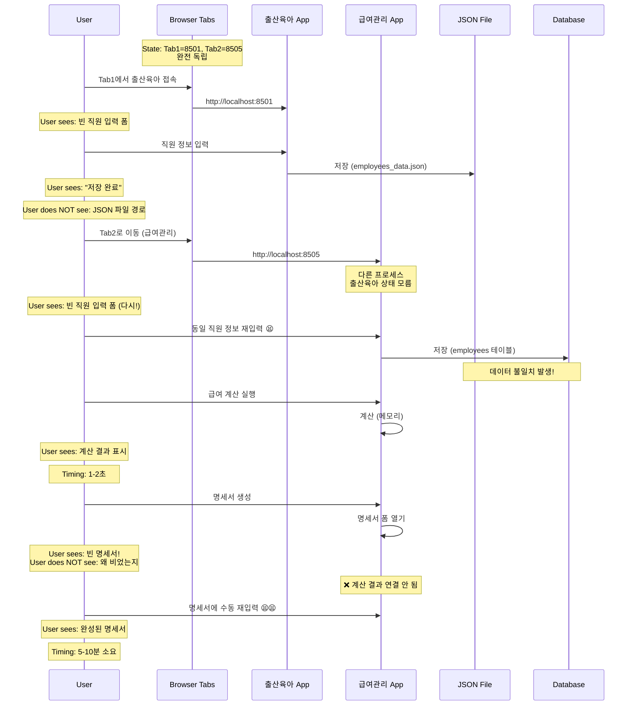
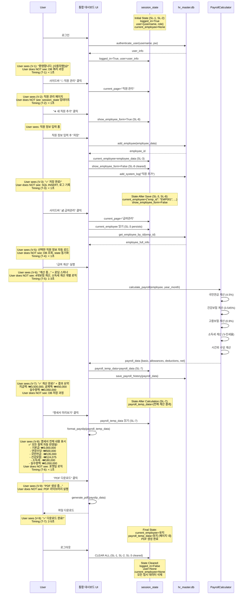
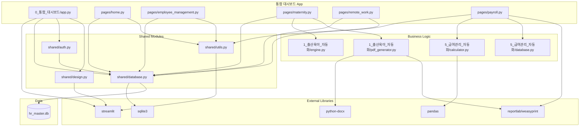

# Technical Implementation Blueprint: 인사팀 자동화 시스템 통합

> **Traceability Note:** This Blueprint extracts from PRD sections §1-§10. All tables include "Source: PRD §X" annotations. Section numbers (§1-§11) are referenced by the Task List.

## §1. Current vs Target Analysis

### §1.1 Current System Architecture



**Current Problems:**
- 6개 독립 프로세스 (포트 8000, 8501-8505)
- 출산육아는 JSON 파일 사용 (데이터 동기화 불가)
- 통합 대시보드는 링크만 제공
- 데이터 중복 입력 필수
- 급여명세서 자동 반영 안 됨

### §1.2 Target System Architecture



**Target Benefits:**
- 단일 포트 8000에서 모든 기능 실행
- 통합 직원 관리 페이지에서 모든 데이터 관리
- session_state 공유로 모듈 간 데이터 자동 동기화
- JSON 파일 완전 제거
- 급여 계산 → 명세서 완전 자동화

### §1.3 Current Data & Logic Flow



**Current Problems:**
- JSON과 DB 이중 데이터 소스
- 급여 계산과 명세서 생성 연결 끊김
- 포트 간 이동 시 데이터 손실
- 수동 재입력 필수

### §1.4 Target Data & Logic Flow



**Target Benefits:**
- 직원 정보 한 번만 입력
- 모든 페이지에서 자동 로드
- 급여 계산 → 명세서 완전 자동화
- 데이터 일관성 보장

### §1.5 Current User Journey with Data & State Flow
*Source: PRD §6 (current state), §8 (current state)*



**Current Pain Points:**
- 여러 탭/포트 오가며 작업
- 동일 정보 반복 입력
- 계산 결과 명세서 반영 안 됨
- 수동 작업 과다

### §1.6 Target User Journey with Data & State Flow
*Source: PRD §6 (V-1 through V-12, T-1 through T-10), §8 (SL-1 through SL-9)*



**Diagram Requirements Met:**
- ✅ 모든 State 변화 표시 (SL-1 ~ SL-9)
- ✅ "User sees" vs "User does NOT see" 명확히 구분 (V-1 ~ V-12)
- ✅ Timing 명시 (T-1 ~ T-10)
- ✅ 급여 계산 → 명세서 자동 반영 플로우
- ✅ session_state 생명주기 (생성 → 유지 → 삭제)

### §1.7 Summary of Improvements
*Source: PRD §2 Problem Statement*

- **포트 통합**: 6개 포트(8000, 8501-8505) → 단일 포트(8000)로 통합하여 사용자가 하나의 탭에서 모든 업무 처리
- **데이터 입력 중복 제거**: 통합 직원 관리 페이지에서 한 번만 입력하면 모든 모듈에 자동 반영
- **데이터 일관성 보장**: JSON 파일 제거 및 hr_master.db 단일 데이터 소스 사용으로 데이터 동기화 문제 해결
- **급여명세서 자동화**: 급여 계산 결과가 명세서에 100% 자동 반영되어 수동 재입력 완전 제거
- **사용자 경험 개선**: 사이드바 네비게이션으로 3클릭 이내 모든 기능 접근, 페이지 전환 1초 이내
- **개발/유지보수 효율화**: 통합 대시보드 실질적 허브 역할, 모듈 간 코드 중복 최소화

---

## §2. System Boundaries
*Source: PRD §7 Artifact Ownership*

### §2.1 Artifact Ownership Enforcement
*Source: PRD §7.1 Creation Responsibility*

| PRD ID | Artifact | Created By | App's Role | Implementation Rule |
|--------|----------|------------|------------|---------------------|
| O-1 | hr_master.db (SQLite 파일) | App | Create + Manage | **DO** init_master_database() 최초 실행 시 호출. **DO NOT** 외부 DB 서버 의존 |
| O-2 | 직원 레코드 (employees 테이블) | App | Create + Update + Delete | **DO** add_employee(), update_employee(), delete_employee() 사용. **DO NOT** 직접 SQL 쿼리 실행 |
| O-3 | 근무 로그 (work_logs 테이블) | App | Create | **DO** 재택근무 페이지에서 저장. **DO NOT** 수동 DB 삽입 |
| O-4 | 급여 내역 (payroll_history 테이블) | App | Create | **DO** save_payroll_history() 호출. **DO NOT** 계산 결과를 메모리에만 유지 |
| O-5 | 급여명세서 PDF | App | Create + Deliver to User | **DO** 메모리 내 생성 후 즉시 다운로드. **DO NOT** 서버 디스크에 저장 |
| O-6 | 급여대장 Excel | App | Create + Deliver to User | **DO** BytesIO로 메모리 생성. **DO NOT** 서버 디스크에 저장 |
| O-7 | 출산육아 정부 서식 PDF | App | Create + Deliver to User | **DO** 메모리 생성 후 다운로드. **DO NOT** 디스크 저장 |
| O-8 | 출산육아 Word 문서 | App | Create + Deliver to User | **DO** docx 라이브러리로 생성. **DO NOT** 디스크 저장 |
| O-9 | 시스템 로그 (system_logs 테이블) | App | Create | **DO** add_system_log() 모든 중요 액션마다 호출. **DO NOT** 생략 |
| O-10 | 사용자 세션 (st.session_state) | App | Create + Maintain + Destroy | **DO** 로그인 시 생성, 로그아웃 시 clear(). **DO NOT** 세션 누수 |
| O-11 | 마이그레이션 로그 | App | Create + Log to system_logs | **DO** 마이그레이션 스크립트에서 로깅. **DO NOT** 무시 |

### §2.2 External System Behaviors
*Source: PRD §7.2 External System Dependencies*

| PRD ID | External System | Autonomous Actions | App's Response | Detection Method |
|--------|-----------------|-------------------|----------------|------------------|
| E-1 | 없음 (No External Systems) | N/A | N/A | N/A |

**Note:** 이 시스템은 완전히 독립적으로 실행되며 외부 시스템 의존성이 없습니다.

### §2.3 Boundary Rules
*Source: PRD §7.3 Derived Ownership Rules*

| PRD Source | Rule | Rationale | Enforcement |
|------------|------|-----------|-------------|
| O-1 | App은 hr_master.db를 직접 생성하고 관리해야 함. 외부 DB 서버 사용 금지 | SQLite로 독립 실행 보장 | shared/database.py의 DB_PATH = 프로젝트 루트/hr_master.db 고정 |
| O-2 | 직원 데이터는 오직 hr_master.db에만 저장. JSON 파일 사용 금지 | 데이터 일관성 보장 | employees_data.json 삭제, 모든 모듈에서 get_all_employees() 사용 |
| O-5, O-6, O-7, O-8 | 다운로드 파일은 메모리 내에서 생성 후 즉시 전달. 서버 디스크 저장 금지 | 디스크 공간 절약 및 보안 | BytesIO, tempfile 사용, 생성 후 즉시 st.download_button() |
| O-9 | 모든 중요 액션(로그인, 데이터 변경, 계산)은 system_logs에 기록 필수 | 감사 추적 및 문제 해결 | 모든 CRUD 함수에서 add_system_log() 호출 |
| O-10 | 로그아웃 시 session_state 완전 초기화 필수 | 보안 및 메모리 누수 방지 | st.session_state.clear() 호출, 민감 정보 제거 확인 |

---

## §3. State Transition Specifications
*Source: PRD §8 State Requirements*

### §3.1 Transition: 사용자 로그인
*Source: PRD §8.2 SL-1, SL-2*

**Trigger:** 로그인 버튼 클릭 + 인증 성공

**Pre-conditions (State Before):**
*Source: PRD §8.1 State Isolation, §8.2 Lifecycle*

| PRD ID | State Variable | Current Value | Required Action |
|--------|----------------|---------------|----------------|
| SL-1 | session_state.logged_in | False | KEEP (초기값) |
| SL-2 | session_state.user | None | KEEP (초기값) |
| SI-1 | 다른 사용자 세션 | 격리됨 | VERIFY (Streamlit 기본 격리) |

**Post-conditions (State After):**
*Source: PRD §8.2 Lifecycle*

| PRD ID | State Variable | New Value | Set By |
|--------|----------------|-----------|--------|
| SL-1 | session_state.logged_in | True | authenticate_user() 성공 후 |
| SL-2 | session_state.user | {username, role, emp_name, ...} | authenticate_user() 반환값 |
| SL-9 | session_state.current_page | "대시보드" | 로그인 성공 후 기본 페이지 |

**Side Effects:**
- system_logs 테이블에 로그인 기록 (O-9)
- users 테이블의 last_login 타임스탬프 업데이트
- 대시보드 페이지로 자동 이동

### §3.2 Transition: 직원 선택
*Source: PRD §8.2 SL-3*

**Trigger:** 직원 관리 페이지 또는 다른 모듈에서 직원 드롭다운 선택

**Pre-conditions (State Before):**
| PRD ID | State Variable | Current Value | Required Action |
|--------|----------------|---------------|----------------|
| SL-1 | session_state.logged_in | True | VERIFY (로그인 확인) |
| SL-3 | session_state.current_employee | None 또는 이전 직원 | REPLACE |

**Post-conditions (State After):**
| PRD ID | State Variable | New Value | Set By |
|--------|----------------|-----------|--------|
| SL-3 | session_state.current_employee | 선택한 직원의 전체 정보 딕셔너리 | get_employee_by_id() 결과 |

**Side Effects:**
- 모든 페이지에서 current_employee 읽기 가능 (SI-3 유지)
- 급여관리 페이지 자동 새로고침 (선택 직원 변경 시)

### §3.3 Transition: 직원 정보 저장/수정
*Source: PRD §8.2 SL-3, SL-8*

**Trigger:** 직원 관리 폼에서 "저장" 버튼 클릭

**Pre-conditions (State Before):**
| PRD ID | State Variable | Current Value | Required Action |
|--------|----------------|---------------|----------------|
| SL-1 | session_state.logged_in | True | VERIFY |
| SL-8 | session_state.show_employee_form | True | VERIFY (폼 표시 중) |
| SI-2 | 미로그인 사용자 | 접근 불가 | BLOCK |

**Post-conditions (State After):**
| PRD ID | State Variable | New Value | Set By |
|--------|----------------|-----------|--------|
| SL-3 | session_state.current_employee | 새로 저장/수정된 직원 정보 | add_employee() 또는 update_employee() 후 |
| SL-8 | session_state.show_employee_form | False | 저장 성공 후 초기화 |

**Side Effects:**
- employees 테이블에 INSERT/UPDATE (O-2)
- system_logs에 "직원 추가" 또는 "직원 수정" 기록 (O-9)
- 직원 목록 새로고침
- 성공 토스트 알림 표시 (V-3, V-4)

### §3.4 Transition: 급여 계산 시작
*Source: PRD §8.2 SL-7*

**Trigger:** 급여관리 페이지에서 "급여 계산" 버튼 클릭

**Pre-conditions (State Before):**
| PRD ID | State Variable | Current Value | Required Action |
|--------|----------------|---------------|----------------|
| SL-3 | session_state.current_employee | 선택된 직원 정보 | VERIFY (직원 선택 필수) |
| SL-7 | session_state.payroll_temp_data | {} 또는 이전 계산 결과 | CLEAR |

**Post-conditions (State After):**
| PRD ID | State Variable | New Value | Set By |
|--------|----------------|-----------|--------|
| SL-7 | session_state.payroll_temp_data | {basic_salary, allowances, deductions, total_payment, total_deduction, net_payment} | PayrollCalculator.calculate_payroll() 결과 |

**Side Effects:**
- payroll_history 테이블에 INSERT (O-4)
- 계산 결과 요약 표시 (V-7)
- 명세서 미리보기 버튼 활성화

### §3.5 Transition: 급여명세서 생성
*Source: PRD §6.1 V-8, PRD §8.2 SL-7*

**Trigger:** "명세서 미리보기" 또는 "PDF 다운로드" 버튼 클릭

**Pre-conditions (State Before):**
| PRD ID | State Variable | Current Value | Required Action |
|--------|----------------|---------------|----------------|
| SL-7 | session_state.payroll_temp_data | 계산 완료된 급여 데이터 | VERIFY (계산 먼저 필수) |
| SI-4 | 불완전한 계산 데이터 | 없어야 함 | VALIDATE |

**Post-conditions (State After):**
| PRD ID | State Variable | New Value | Set By |
|--------|----------------|-----------|--------|
| SL-7 | session_state.payroll_temp_data | 유지 (변경 없음) | N/A |

**Side Effects:**
- format_payslip() 호출하여 명세서 데이터 생성
- 명세서 HTML 또는 PDF 렌더링
- PDF 생성 시 BytesIO 메모리 객체 생성 (O-5)
- 사용자에게 다운로드 제공 (V-9)

### §3.6 Transition: 페이지 전환
*Source: PRD §8.2 SL-9, PRD §8.1 SI-3*

**Trigger:** 사이드바 메뉴 선택

**Pre-conditions (State Before):**
| PRD ID | State Variable | Current Value | Required Action |
|--------|----------------|---------------|----------------|
| SL-1 | session_state.logged_in | True | VERIFY |
| SL-9 | session_state.current_page | 이전 페이지 | REPLACE |
| SI-3 | 이전 페이지 임시 상태 | 페이지별 상태 존재 | CLEAR (페이지별) |

**Post-conditions (State After):**
| PRD ID | State Variable | New Value | Set By |
|--------|----------------|-----------|--------|
| SL-9 | session_state.current_page | 선택한 페이지명 | st.navigation() |
| SL-3 | session_state.current_employee | 유지 (공통 상태) | PERSIST |
| SL-2 | session_state.user | 유지 (공통 상태) | PERSIST |

**Side Effects:**
- 이전 페이지의 임시 상태 초기화 (SI-3)
- 새 페이지 init 함수 실행
- 공통 상태(로그인, 선택 직원)는 유지 (SI-3)

### §3.7 Transition: 로그아웃
*Source: PRD §8.2 SL-1, SL-2, SL-3 모두 Clear*

**Trigger:** "로그아웃" 버튼 클릭

**Pre-conditions (State Before):**
| PRD ID | State Variable | Current Value | Required Action |
|--------|----------------|---------------|----------------|
| SL-1 | session_state.logged_in | True | CLEAR |
| SL-2 | session_state.user | 사용자 정보 | CLEAR |
| SL-3 | session_state.current_employee | 선택 직원 | CLEAR |
| SL-7, SL-8 | 모든 임시 상태 | 다양 | CLEAR ALL |

**Post-conditions (State After):**
| PRD ID | State Variable | New Value | Set By |
|--------|----------------|-----------|--------|
| SL-1 | session_state.logged_in | False | st.session_state.clear() |
| SL-2 | session_state.user | None | st.session_state.clear() |
| 모든 상태 | 모든 session_state | 초기값 | st.session_state.clear() |

**Side Effects:**
- 로그인 페이지로 리다이렉트
- 모든 민감 정보 메모리에서 제거
- system_logs에 "로그아웃" 기록

---

## §4. Integration Wiring
*Derived from: PRD §7 (ownership), §8 (state), §6 (visibility)*

### §4.1 직원 정보 저장 플로우
*Implements: PRD §7.1 O-2, §6.1 V-3, §8.2 SL-3, SL-8*

```
save_employee_handler(employee_form_data)
  ├─ FIRST: validate_employee_data(employee_form_data)
  │         // Critical: 필수 필드 검증 (이름, 부서, 직급)
  │         // Source: PRD §4.1 FR-3
  ├─ THEN: add_employee(employee_data) OR update_employee(emp_id, employee_data)
  │         // Creates: employees 테이블 레코드 (O-2)
  │         // Returns: employee_id
  ├─ THEN: add_system_log(username, "직원 추가", "employee_management")
  │         // Creates: system_logs 레코드 (O-9)
  ├─ THEN: session_state.current_employee = get_employee_by_id(employee_id)
  │         // Updates: SL-3 state
  ├─ THEN: session_state.show_employee_form = False
  │         // Clears: SL-8 state
  └─ THEN: show_success("✅ 저장 완료!")
            // Displays: V-3 visibility (user sees toast)
            // Hides: SQL queries (user does NOT see)
```

**Call Sequence:**
| Order | Call | Purpose | PRD Source | Critical |
|-------|------|---------|------------|----------|
| 1 | validate_employee_data() | 필수 필드 검증 (이름, 부서, 직급) | §4.1 FR-3 | Yes |
| 2 | add_employee() / update_employee() | DB에 직원 정보 저장 | §7.1 O-2 | Yes |
| 3 | add_system_log() | 감사 로그 기록 | §7.1 O-9 | Yes |
| 4 | Update session_state.current_employee | 공유 상태 업데이트 | §8.2 SL-3 | Yes |
| 5 | Clear session_state.show_employee_form | 폼 닫기 | §8.2 SL-8 | No |
| 6 | show_success() | 사용자 피드백 | §6.1 V-3 | Yes |

### §4.2 급여 계산 → 명세서 생성 파이프라인
*Implements: PRD §7.1 O-4, O-5, §6.1 V-6, V-7, V-8, V-9, §8.2 SL-7*

```
calculate_and_generate_payslip(employee, year_month)
  ├─ FIRST: validate_employee_payroll_data(employee)
  │         // Critical: 급여 정보 존재 확인
  ├─ THEN: payroll_calculator.calculate_payroll(employee, year_month)
  │         ├─ calculate_national_pension() → 4.5%
  │         ├─ calculate_health_insurance() → 3.545% + 장기요양 12.81%
  │         ├─ calculate_employment_insurance() → 0.9%
  │         ├─ calculate_income_tax(basic + allowances - deductions) → 누진세율
  │         ├─ calculate_overtime_allowances(overtime_hours)
  │         └─ RETURN: payroll_data {
  │               basic_salary: int,
  │               allowances: {overtime, night, holiday, annual_leave},
  │               deductions: {national_pension, health_insurance, ...},
  │               total_payment: int,
  │               total_deduction: int,
  │               net_payment: int
  │             }
  ├─ THEN: save_payroll_history(employee_id, year_month, payroll_data)
  │         // Creates: payroll_history 레코드 (O-4)
  ├─ THEN: session_state.payroll_temp_data = payroll_data
  │         // Updates: SL-7 state
  ├─ THEN: show_success(f"✅ 계산 완료! 실수령액: {format_currency(net_payment)}")
  │         // Displays: V-7 visibility
  │
  ├─ WHEN USER CLICKS "명세서 미리보기":
  │   ├─ THEN: payslip_data = format_payslip(payroll_data)
  │   │         // Transforms: payroll_data → 명세서 표시 포맷
  │   │         // Includes: 모든 지급 항목, 모든 공제 항목, 실수령액
  │   └─ THEN: display_payslip_preview(payslip_data)
  │             // Displays: V-8 visibility (모든 항목 자동 반영됨!)
  │
  └─ WHEN USER CLICKS "PDF 다운로드":
      ├─ THEN: pdf_bytes = generate_payslip_pdf(payslip_data)
      │         // Creates: BytesIO PDF in memory (O-5)
      │         // Does NOT save to disk (§2.3 boundary rule)
      └─ THEN: st.download_button("다운로드", pdf_bytes, file_name="...")
                // Delivers: PDF to user
                // Displays: V-9 visibility ("✅ 다운로드 완료!")
```

**Call Sequence:**
| Order | Call | Purpose | PRD Source | Critical |
|-------|------|---------|------------|----------|
| 1 | validate_employee_payroll_data() | 급여 정보 검증 | §4.1 FR-8 | Yes |
| 2 | calculate_payroll() | 4대보험, 소득세, 수당 전체 계산 | §4.1 FR-8~FR-11 | Yes |
| 3 | save_payroll_history() | 계산 결과 DB 저장 | §7.1 O-4 | Yes |
| 4 | Update session_state.payroll_temp_data | 명세서 생성을 위한 데이터 저장 | §8.2 SL-7 | Yes |
| 5 | show_success() | 계산 완료 피드백 | §6.1 V-7 | Yes |
| 6 | format_payslip() | payroll_data → 명세서 포맷 | §4.1 FR-12 | Yes |
| 7 | generate_payslip_pdf() | 명세서 PDF 생성 (메모리) | §7.1 O-5 | Yes |
| 8 | st.download_button() | 사용자에게 전달 | §6.1 V-9 | Yes |

**Critical Enforcement:**
- 계산 결과 (Step 2) → 명세서 데이터 (Step 4) → PDF 생성 (Step 7) 파이프라인 끊김 없이 연결
- 수동 재입력 단계 완전 제거
- 모든 계산 항목이 명세서에 100% 자동 반영

### §4.3 페이지 전환 및 데이터 동기화
*Implements: PRD §8.1 SI-3, §8.2 SL-9, §6.1 V-2, V-5*

```
navigate_to_page(page_name)
  ├─ FIRST: verify_logged_in()
  │         // Critical: SI-2 로그인 확인
  │         // If not logged_in → redirect to login
  ├─ THEN: session_state.current_page = page_name
  │         // Updates: SL-9
  ├─ THEN: clear_page_specific_state(previous_page)
  │         // Clears: SI-3 임시 상태
  │         // Keeps: SL-1 (logged_in), SL-2 (user), SL-3 (current_employee)
  ├─ THEN: st.navigation() or st.rerun()
  │         // Transitions to new page
  │
  └─ IN NEW PAGE: init_page()
      ├─ IF current_employee in session_state:
      │   ├─ THEN: employee = get_employee_by_id(current_employee['emp_id'])
      │   │         // Refreshes data from DB
      │   └─ THEN: display_employee_info(employee)
      │             // Displays: V-5 visibility (자동 로드)
      └─ ELSE:
          └─ THEN: show_info("직원을 선택해주세요")
```

**Call Sequence:**
| Order | Call | Purpose | PRD Source | Critical |
|-------|------|---------|------------|----------|
| 1 | verify_logged_in() | 로그인 상태 확인 | §8.1 SI-2 | Yes |
| 2 | Update session_state.current_page | 현재 페이지 추적 | §8.2 SL-9 | No |
| 3 | clear_page_specific_state() | 이전 페이지 임시 상태 제거 | §8.1 SI-3 | Yes |
| 4 | st.navigation() / st.rerun() | 페이지 전환 | Streamlit API | Yes |
| 5 | get_employee_by_id() | 선택 직원 최신 정보 조회 | §4.1 FR-4 | Yes |
| 6 | display_employee_info() | 직원 정보 표시 | §6.1 V-5 | Yes |

---

## §5. System Components
*Source: PRD §4.1 Functional Requirements, CODEBASE_CONTEXT*

### §5.1 Frontend Components (Streamlit Pages)

| Component | File Path | Purpose | PRD Source |
|-----------|-----------|---------|------------|
| 메인 앱 | 0_통합_대시보드/app.py | Streamlit 진입점, st.navigation 설정, 로그인 처리 | FR-1, FR-2 |
| 홈 대시보드 페이지 | 0_통합_대시보드/pages/home.py | 전체 인사 현황 메트릭 표시 | FR-16 |
| 직원 관리 페이지 | 0_통합_대시보드/pages/employee_management.py | 직원 CRUD, 통합 관리 인터페이스 | FR-3, FR-4 |
| 출산육아 페이지 | 0_통합_대시보드/pages/maternity.py | 재택근무 로그, 지원금 계산, 정부 서식 생성 | FR-5 |
| 재택근무 페이지 | 0_통합_대시보드/pages/remote_work.py | 일정 관리, 근무 기록, 월간 리포트 | FR-6 |
| 급여관리 페이지 | 0_통합_대시보드/pages/payroll.py | 급여 계산, 명세서 생성, 급여대장 | FR-7~FR-12 |
| 설정 페이지 | 0_통합_대시보드/pages/settings.py | 사용자 설정, 시스템 정보 | 기타 |

### §5.2 Backend Components (Shared Modules)

| Component | File Path | Purpose | PRD Source |
|-----------|-----------|---------|------------|
| 데이터베이스 모듈 | shared/database.py | SQLite 연결, CRUD API, 데이터 동기화 | FR-13, FR-14 |
| 인증 모듈 | shared/auth.py | 로그인, 권한 관리, 비밀번호 해싱 | FR-15, NFR-7 |
| 디자인 시스템 | shared/design.py | 통일된 CSS, Modern Green Minimal | 기타 |
| 유틸리티 모듈 | shared/utils.py | 토스트 알림, 포맷팅 함수 | 전반 |
| 급여 계산기 | 5_급여관리_자동화/calculator.py | 4대보험, 소득세, 수당 계산 로직 | FR-8~FR-11 |
| 급여 데이터베이스 | 5_급여관리_자동화/database.py | 급여 특화 테이블 관리 | FR-7 |
| 출산육아 엔진 | 1_출산육아_자동화/engine.py | 지원금 계산, 로그 생성 로직 | FR-5 |
| PDF 생성기 (출산육아) | 1_출산육아_자동화/pdf_generator.py | 정부 서식 PDF 생성 | FR-5 |
| PDF 생성기 (급여) | 5_급여관리_자동화/payslip_pdf.py | 급여명세서 PDF 생성 | FR-12 |

### §5.3 Data Migration Components

| Component | File Path | Purpose | PRD Source |
|-----------|-----------|---------|------------|
| 마이그레이션 스크립트 | scripts/migrate_json_to_db.py | employees_data.json → hr_master.db 이전 | FR-14 |
| 마이그레이션 검증 | scripts/verify_migration.py | 마이그레이션 전후 데이터 검증 | NFR-8 |

---

## §6. Data Models
*Source: PRD §4.1 Functional Requirements, CODEBASE_CONTEXT*

### §6.1 Database Schema

**Note:** hr_master.db는 이미 shared/database.py에 완벽하게 정의되어 있음. 변경사항 없음.

```sql
-- Source: PRD FR-13, 기존 shared/database.py (already implemented)

-- 1. 직원 마스터 테이블 (O-2)
CREATE TABLE IF NOT EXISTS employees (
    id INTEGER PRIMARY KEY AUTOINCREMENT,
    emp_id TEXT UNIQUE NOT NULL,
    name TEXT NOT NULL,
    resident_number TEXT,
    department TEXT,
    position TEXT,
    hire_date DATE,
    gender TEXT CHECK(gender IN ('남성', '여성', NULL)),
    age INTEGER,
    email TEXT,
    phone TEXT,
    -- 상태 정보
    is_active BOOLEAN DEFAULT 1,
    is_pregnant BOOLEAN DEFAULT 0,
    is_on_leave BOOLEAN DEFAULT 0,
    is_youth BOOLEAN DEFAULT 0,
    is_disabled BOOLEAN DEFAULT 0,
    -- 감사 정보
    created_at TIMESTAMP DEFAULT CURRENT_TIMESTAMP,
    updated_at TIMESTAMP DEFAULT CURRENT_TIMESTAMP,
    created_by TEXT,
    notes TEXT
);

CREATE INDEX idx_emp_id ON employees(emp_id);
CREATE INDEX idx_emp_name ON employees(name);
CREATE INDEX idx_emp_dept ON employees(department);

-- 2. 사용자 인증 테이블 (O-10 관련)
CREATE TABLE IF NOT EXISTS users (
    id INTEGER PRIMARY KEY AUTOINCREMENT,
    username TEXT UNIQUE NOT NULL,
    password_hash TEXT NOT NULL,
    emp_id TEXT,
    role TEXT CHECK(role IN ('admin', 'hr', 'manager', 'employee')) DEFAULT 'employee',
    is_active BOOLEAN DEFAULT 1,
    last_login TIMESTAMP,
    created_at TIMESTAMP DEFAULT CURRENT_TIMESTAMP,
    FOREIGN KEY (emp_id) REFERENCES employees(emp_id) ON DELETE SET NULL
);

CREATE INDEX idx_username ON users(username);

-- 3. 근무 기록 테이블 (O-3)
CREATE TABLE IF NOT EXISTS work_logs (
    id INTEGER PRIMARY KEY AUTOINCREMENT,
    emp_id TEXT NOT NULL,
    work_date DATE NOT NULL,
    work_type TEXT DEFAULT '재택근무',
    start_time TIME,
    end_time TIME,
    break_time TEXT DEFAULT '12:00-13:00',
    work_hours REAL,
    work_description TEXT,
    status TEXT DEFAULT 'approved' CHECK(status IN ('pending', 'approved', 'rejected')),
    is_manual BOOLEAN DEFAULT 1,
    created_at TIMESTAMP DEFAULT CURRENT_TIMESTAMP,
    created_by TEXT,
    modified_at TIMESTAMP,
    modified_by TEXT,
    FOREIGN KEY (emp_id) REFERENCES employees(emp_id) ON DELETE CASCADE
);

CREATE INDEX idx_work_date ON work_logs(work_date);
CREATE INDEX idx_work_emp_date ON work_logs(emp_id, work_date);

-- 4. 시스템 로그 테이블 (O-9)
CREATE TABLE IF NOT EXISTS system_logs (
    id INTEGER PRIMARY KEY AUTOINCREMENT,
    timestamp TIMESTAMP DEFAULT CURRENT_TIMESTAMP,
    username TEXT,
    action TEXT NOT NULL,
    module TEXT,
    details TEXT,
    ip_address TEXT,
    level TEXT DEFAULT 'INFO' CHECK(level IN ('DEBUG', 'INFO', 'WARNING', 'ERROR', 'CRITICAL'))
);

CREATE INDEX idx_log_timestamp ON system_logs(timestamp);
CREATE INDEX idx_log_username ON system_logs(username);
CREATE INDEX idx_log_module ON system_logs(module);

-- 5. 회사 정보 테이블
CREATE TABLE IF NOT EXISTS company_profile (
    id INTEGER PRIMARY KEY AUTOINCREMENT,
    company_name TEXT NOT NULL,
    ceo_name TEXT,
    business_number TEXT,
    business_type TEXT,
    employee_count INTEGER,
    annual_revenue INTEGER,
    location TEXT,
    is_priority_support BOOLEAN DEFAULT 0,
    situations TEXT, -- JSON
    employee_stats TEXT, -- JSON
    created_at TIMESTAMP DEFAULT CURRENT_TIMESTAMP,
    updated_at TIMESTAMP DEFAULT CURRENT_TIMESTAMP,
    updated_by TEXT
);

-- 6. 급여 내역 테이블 (O-4) - 5_급여관리_자동화/database.py에 이미 정의됨
-- payroll_history, payroll_settings, overtime_logs, annual_leave 등
-- 변경사항 없음, 기존 구조 유지
```

### §6.2 Session State Schema
*Source: PRD §8.2 State Lifecycle*

```python
# Streamlit session_state structure

session_state = {
    # SL-1: 로그인 상태
    'logged_in': bool,  # False → True (login) → False (logout)
    
    # SL-2: 사용자 정보
    'user': {
        'id': int,
        'username': str,
        'role': str,  # 'admin', 'hr', 'manager', 'employee'
        'emp_name': str,
        'department': str
    } or None,
    
    # SL-3: 선택 직원 (모든 페이지에서 공유)
    'current_employee': {
        'emp_id': str,
        'name': str,
        'department': str,
        'position': str,
        'hire_date': date,
        ... # 기타 직원 정보
    } or None,
    
    # SL-4: 직원 관리자 인스턴스
    'employee_manager': EmployeeDataManager,
    
    # SL-5: 급여 계산기 인스턴스
    'payroll_calculator': PayrollCalculator,
    
    # SL-6: 현재 년월
    'current_year_month': str,  # 'YYYY-MM'
    
    # SL-7: 급여 계산 임시 데이터 (급여관리 페이지만)
    'payroll_temp_data': {
        'basic_salary': int,
        'allowances': dict,
        'deductions': dict,
        'total_payment': int,
        'total_deduction': int,
        'net_payment': int
    } or {},
    
    # SL-8: 직원 폼 표시 여부 (직원 관리 페이지만)
    'show_employee_form': bool,
    'form_mode': str,  # 'add' or 'edit'
    
    # SL-9: 현재 페이지
    'current_page': str  # '대시보드', '직원 관리', '출산육아', etc.
}
```

---

## §7. API Specifications
*Source: PRD §4.1 Functional Requirements*

### §7.1 Internal API (Shared Modules)

**Note:** 이 시스템은 REST API가 아닌 Python 함수 API를 사용합니다.

#### 7.1.1 Database API (shared/database.py)

| Function | Parameters | Returns | Purpose | PRD Source |
|----------|------------|---------|---------|------------|
| get_db() | None | ContextManager[Connection] | SQLite 연결 관리 | 전반 |
| init_master_database() | None | None | DB 테이블 생성 | FR-13 |
| get_all_employees(active_only=True) | active_only: bool | List[Dict] | 전체 직원 조회 | FR-3, FR-4 |
| get_employee_by_id(emp_id) | emp_id: str | Dict or None | 특정 직원 조회 | FR-4 |
| get_employee_by_name(name) | name: str | Dict or None | 이름으로 직원 조회 | FR-3 |
| add_employee(employee_data) | employee_data: Dict | int (employee_id) | 직원 추가 | FR-3 |
| update_employee(emp_id, employee_data) | emp_id: str, employee_data: Dict | bool | 직원 정보 수정 | FR-4 |
| delete_employee(emp_id, hard_delete=False) | emp_id: str, hard_delete: bool | bool | 직원 삭제 (소프트) | FR-3 |
| get_company_profile() | None | Dict or None | 회사 정보 조회 | FR-16 |
| update_company_profile(profile_data) | profile_data: Dict | None | 회사 정보 수정 | FR-16 |
| add_system_log(username, action, module, details, level) | 여러 파라미터 | None | 시스템 로그 기록 | O-9 |

#### 7.1.2 Authentication API (shared/auth.py)

| Function | Parameters | Returns | Purpose | PRD Source |
|----------|------------|---------|---------|------------|
| authenticate_user(username, password) | username: str, password: str | Dict or None | 사용자 인증 | FR-15 |
| create_user(username, password, emp_id, role) | 여러 파라미터 | bool | 사용자 생성 | FR-15 |
| check_permission(user, required_role) | user: Dict, required_role: str | bool | 권한 확인 | NFR-7 |
| change_password(username, old_pw, new_pw) | 여러 파라미터 | bool | 비밀번호 변경 | 기타 |

#### 7.1.3 Payroll Calculator API (5_급여관리_자동화/calculator.py)

| Method | Parameters | Returns | Purpose | PRD Source |
|--------|------------|---------|---------|------------|
| calculate_payroll(employee, year_month) | employee: Dict, year_month: str | Dict (payroll_data) | 전체 급여 계산 | FR-8~FR-12 |
| calculate_national_pension(salary) | salary: int | int | 국민연금 계산 (4.5%) | FR-8 |
| calculate_health_insurance(salary) | salary: int | int | 건강보험 + 장기요양 | FR-8 |
| calculate_employment_insurance(salary) | salary: int | int | 고용보험 (0.9%) | FR-8 |
| calculate_income_tax(taxable_income) | taxable_income: int | int | 소득세 (누진세율) | FR-9 |
| calculate_overtime_pay(basic_hourly, overtime_hours) | 여러 파라미터 | Dict | 시간외 수당 | FR-10 |
| calculate_annual_leave_allowance(daily_wage, unused_days) | 여러 파라미터 | int | 연차수당 | FR-11 |
| format_payslip(payroll_data) | payroll_data: Dict | Dict | 명세서 데이터 포맷팅 | FR-12 |
| generate_payslip_pdf(payslip_data) | payslip_data: Dict | BytesIO | 명세서 PDF 생성 | O-5 |

#### 7.1.4 Maternity Engine API (1_출산육아_자동화/engine.py)

| Function/Class | Purpose | PRD Source |
|----------------|---------|------------|
| SmartWorkLogGenerator | 재택근무 로그 생성 | FR-5 |
| SubsidyCalculator | 지원금 계산 | FR-5 |
| GovernmentFormMapper | 정부 서식 매핑 | FR-5 |
| generate_pdf_forms() | 정부 서식 PDF 생성 | O-7 |

### §7.2 Payroll Data Flow Contract
*Source: PRD §4.1 FR-8~FR-12, §6 V-7, V-8*

```python
# Critical: 급여 계산 → 명세서 파이프라인 데이터 구조

# Step 1: calculate_payroll() 반환값 (표준화된 구조)
payroll_data = {
    'employee': {
        'emp_id': 'EMP001',
        'name': '홍길동',
        'department': '개발팀',
        'position': '사원'
    },
    'period': {
        'year': 2026,
        'month': 1,
        'year_month': '2026-01'
    },
    'payment': {
        'basic_salary': 3000000,  # 기본급
        'allowances': {
            'overtime': 500000,     # 연장수당
            'night': 0,             # 야간수당
            'holiday': 0,           # 휴일수당
            'annual_leave': 0       # 연차수당
        },
        'total': 3500000           # 총 지급액
    },
    'deduction': {
        'national_pension': 135000,   # 국민연금 4.5%
        'health_insurance': 106575,   # 건강보험 3.545%
        'long_term_care': 13655,      # 장기요양 12.81%
        'employment_insurance': 27000, # 고용보험 0.9%
        'income_tax': 180000,         # 소득세
        'local_tax': 18000,           # 지방소득세 10%
        'total': 480230               # 총 공제액
    },
    'net_payment': 3019770,          # 실수령액
    'calculated_at': '2026-01-28 15:30:00',
    'calculated_by': 'admin'
}

# Step 2: format_payslip() 반환값 (명세서 표시용)
payslip_data = {
    'header': {
        'company_name': '(주)테크컴퍼니',
        'period': '2026년 1월분',
        'employee_name': '홍길동',
        'emp_id': 'EMP001',
        'department': '개발팀',
        'position': '사원'
    },
    'payment_items': [
        {'name': '기본급', 'amount': '₩3,000,000'},
        {'name': '연장수당', 'amount': '₩500,000'},
        {'name': '지급 합계', 'amount': '₩3,500,000', 'bold': True}
    ],
    'deduction_items': [
        {'name': '국민연금', 'amount': '₩135,000'},
        {'name': '건강보험', 'amount': '₩106,575'},
        {'name': '장기요양보험', 'amount': '₩13,655'},
        {'name': '고용보험', 'amount': '₩27,000'},
        {'name': '소득세', 'amount': '₩180,000'},
        {'name': '지방소득세', 'amount': '₩18,000'},
        {'name': '공제 합계', 'amount': '₩480,230', 'bold': True}
    ],
    'summary': {
        'total_payment': '₩3,500,000',
        'total_deduction': '₩480,230',
        'net_payment': '₩3,019,770'  # 실수령액 (강조)
    },
    'footer': {
        'calculated_date': '2026년 1월 28일',
        'payment_date': '2026년 2월 5일 (예정)'
    }
}

# Step 3: generate_payslip_pdf() 입력/출력
# Input: payslip_data (위의 구조)
# Output: BytesIO (PDF binary)
pdf_bytes = generate_payslip_pdf(payslip_data)
# → st.download_button("명세서 다운로드", pdf_bytes, "급여명세서_202601_홍길동.pdf")
```

**Critical Enforcement:**
- payroll_data의 모든 필드가 payslip_data에 100% 반영되어야 함
- 수동 입력 단계 없음
- 계산 → 포맷 → PDF 파이프라인 끊김 없이 자동 실행

---

## §8. Implementation Phases
*Derived from: PRD §4.1, §5 User Stories, Q1 사용자 답변*

### Phase 0 – 준비 작업
*Duration: 1-2일*

- [ ] 프로젝트 백업 생성 (_backups/ 폴더)
- [ ] Git 브랜치 생성 (feature/hr-integration)
- [ ] planning/ 폴더 구조 확인
- [ ] 개발 환경 설정 확인 (Python, Streamlit, 패키지)

### Phase 1 – 통합 프레임워크 구축
*Duration: 2-3일*
*Implements: PRD §5.1 (Story §5.1, §5.2, §5.3)*

- [ ] Task 1.1: 0_통합_대시보드/app.py 리팩토링
  - [ ] st.set_page_config() 설정 (페이지 제목, 아이콘, 레이아웃)
  - [ ] apply_design() 호출 (Modern Green Minimal)
  - [ ] 로그인 페이지 구현 (authenticate_user 호출)
  - [ ] session_state 초기화 함수 작성 (SL-1~SL-9)
- [ ] Task 1.2: pages/ 폴더 구조 생성
  - [ ] 0_통합_대시보드/pages/home.py (홈 대시보드)
  - [ ] 0_통합_대시보드/pages/employee_management.py (직원 관리)
  - [ ] 0_통합_대시보드/pages/settings.py (설정)
- [ ] Task 1.3: st.Page + st.navigation 설정
  - [ ] 페이지 정의 (st.Page 객체 생성)
  - [ ] 사이드바 네비게이션 구현
  - [ ] 로그인 상태에 따른 페이지 접근 제어 (SI-2)
- [ ] Task 1.4: 홈 대시보드 페이지 구현
  - [ ] 상단 메트릭 카드 (등록 직원, 특별 관리, 근무 로그, 예상 지원금)
  - [ ] 회사 정보 섹션
  - [ ] 알림 섹션 (임신/휴직 중인 직원)
  - [ ] 최근 활동 로그
- [ ] **Verification**: 포트 8000에서 로그인 → 홈 대시보드 표시 확인

### Phase 2 – 통합 직원 관리 페이지 구축
*Duration: 2-3일*
*Implements: PRD §5.2 (Story §5.2)*

- [ ] Task 2.1: 직원 관리 페이지 UI 구현
  - [ ] 직원 목록 테이블 (이름, 부서, 직급, 입사일, 상태)
  - [ ] 검색 및 필터링 기능
  - [ ] "➕ 새 직원 추가" 버튼
  - [ ] "✏️ 수정" 버튼 (선택 직원)
  - [ ] "🗑️ 삭제" 버튼 (확인 다이얼로그)
- [ ] Task 2.2: 직원 입력 폼 구현
  - [ ] 필수 정보: 이름, 부서, 직급, 입사일
  - [ ] 선택 정보: 주민등록번호, 성별, 나이, 이메일, 전화번호
  - [ ] 특수 상태: is_pregnant, is_on_leave, is_youth, is_disabled
  - [ ] 급여 정보: 기본급, 급여 형태
  - [ ] 유효성 검증 (필수 필드 확인)
- [ ] Task 2.3: 직원 CRUD 로직 연결
  - [ ] add_employee() 호출 → DB 저장
  - [ ] update_employee() 호출 → DB 수정
  - [ ] delete_employee() 호출 → 소프트 삭제
  - [ ] session_state.current_employee 업데이트 (SL-3)
  - [ ] add_system_log() 호출 (O-9)
  - [ ] show_success() 토스트 알림 (V-3, V-4)
- [ ] **Verification**: 직원 추가/수정/삭제 → DB 반영 확인 → 성공 토스트 확인

### Phase 3 – 출산육아 모듈 통합
*Duration: 3-4일*
*Implements: PRD §5.4, §5.5 (Story §5.4, §5.5)*

- [ ] Task 3.1: 데이터 마이그레이션 스크립트 작성
  - [ ] scripts/migrate_json_to_db.py 작성
  - [ ] employees_data.json 읽기
  - [ ] 각 직원 데이터를 hr_master.db로 INSERT
  - [ ] 중복 체크 (emp_id 기준)
  - [ ] 마이그레이션 로그 기록 (O-11)
  - [ ] 진행률 표시 (V-10)
- [ ] Task 3.2: 마이그레이션 실행 및 검증
  - [ ] scripts/verify_migration.py 작성
  - [ ] 마이그레이션 전후 데이터 건수 비교
  - [ ] 마이그레이션 전후 데이터 내용 샘플 비교
  - [ ] 검증 결과 리포트 생성
- [ ] Task 3.3: 출산육아 페이지 리팩토링
  - [ ] 1_출산육아_자동화/app.py → pages/maternity.py로 변환
  - [ ] st.set_page_config() 제거
  - [ ] main() → show_maternity_page() 함수로 변경
  - [ ] JSON 파일 의존성 제거 (shared_employee_manager.py만 사용)
  - [ ] session_state.current_employee 사용
  - [ ] 직원 선택 드롭다운 → get_all_employees() 호출
- [ ] Task 3.4: 출산육아 기능 테스트
  - [ ] 재택근무 로그 생성 기능
  - [ ] 지원금 계산 기능
  - [ ] 정부 서식 PDF 생성 기능
  - [ ] Word 문서 생성 기능
- [ ] **Verification (§5.12)**: 출산육아 페이지에서 직원 선택 → 모든 정보 자동 로드 → 기능 정상 작동

### Phase 4 – 재택근무 모듈 통합
*Duration: 2-3일*
*Implements: PRD §5.6 (Story §5.6)*

- [ ] Task 4.1: 재택근무 페이지 리팩토링
  - [ ] 3_재택근무_관리시스템/app.py → pages/remote_work.py로 변환
  - [ ] st.set_page_config() 제거
  - [ ] main() → show_remote_work_page() 함수로 변경
  - [ ] session_state.current_employee 사용
  - [ ] 직원 선택 시 get_employee_by_id() 호출
- [ ] Task 4.2: 재택근무 기능 테스트
  - [ ] 일정 관리 기능
  - [ ] 근무 기록 추적 기능
  - [ ] 월간 리포트 생성 기능
  - [ ] work_logs 테이블 저장 확인 (O-3)
- [ ] **Verification (§5.13)**: 재택근무 페이지에서 직원 선택 → 일정 관리 → 근무 기록 → 리포트 생성

### Phase 5 – 급여관리 모듈 통합 및 전면 개선 (Critical)
*Duration: 5-7일*
*Implements: PRD §5.7~§5.10 (Story §5.7~§5.10)*

- [ ] Task 5.1: 급여 계산 로직 개선
  - [ ] calculator.py의 PayrollCalculator 클래스 검토
  - [ ] calculate_payroll() 메서드 반환값 표준화 (§7.2 데이터 구조)
  - [ ] 2026년 법령 기준 검증
    - [ ] 국민연금 4.5% 확인
    - [ ] 건강보험 3.545% + 장기요양 12.81% 확인
    - [ ] 고용보험 0.9% 확인
    - [ ] 소득세율 구간 확인
    - [ ] 최저임금 10,030원 검증 로직 확인
  - [ ] 각 계산 메서드에 단위 테스트 추가
- [ ] Task 5.2: 명세서 생성 로직 재구축
  - [ ] format_payslip(payroll_data) 함수 작성
  - [ ] payroll_data → payslip_data 변환 (§7.2 구조)
  - [ ] 모든 지급/공제 항목 100% 반영 확인
  - [ ] 실수령액 계산 검증
- [ ] Task 5.3: PDF 생성 로직 개선
  - [ ] generate_payslip_pdf(payslip_data) 함수 작성
  - [ ] BytesIO로 메모리 생성 (O-5, §2.3 boundary rule)
  - [ ] PDF 템플릿 디자인 개선
  - [ ] 모든 항목 표시 확인
- [ ] Task 5.4: 급여관리 페이지 리팩토링
  - [ ] 5_급여관리_자동화/app.py → pages/payroll.py로 변환
  - [ ] st.set_page_config() 제거
  - [ ] main() → show_payroll_page() 함수로 변경
  - [ ] session_state.current_employee 사용
  - [ ] 계산 플로우 재구성 (§4.2 Integration Wiring)
- [ ] Task 5.5: 급여 계산 → 명세서 파이프라인 연결
  - [ ] "급여 계산" 버튼 → calculate_payroll() 호출
  - [ ] payroll_data를 session_state.payroll_temp_data에 저장 (SL-7)
  - [ ] save_payroll_history() 호출 (O-4)
  - [ ] 계산 완료 토스트 + 결과 요약 표시 (V-7)
  - [ ] "명세서 미리보기" 버튼 활성화
- [ ] Task 5.6: 명세서 미리보기 기능 구현
  - [ ] session_state.payroll_temp_data 읽기 (SL-7)
  - [ ] format_payslip() 호출
  - [ ] 명세서 HTML 렌더링
  - [ ] 모든 항목 자동 반영 확인 (V-8)
- [ ] Task 5.7: PDF 다운로드 기능 구현
  - [ ] "PDF 다운로드" 버튼
  - [ ] generate_payslip_pdf() 호출
  - [ ] st.download_button() 연결
  - [ ] 다운로드 완료 토스트 (V-9)
- [ ] Task 5.8: 급여관리 UI/UX 개선
  - [ ] 계산 플로우 시각화 (데이터 입력 → 계산 → 확인 → 명세서)
  - [ ] 각 단계별 안내 문구
  - [ ] 로딩 인디케이터 (V-6)
  - [ ] 오류 메시지 개선 (V-11)
  - [ ] 급여대장 테이블 정렬/필터링
- [ ] **Verification (§5.14 - Critical)**: 
  - [ ] 실제 급여 데이터 3건 준비
  - [ ] 각 직원 정보 입력
  - [ ] 급여 계산 실행
  - [ ] 계산 결과 vs 실제 급여 비교
    - [ ] 4대보험 100% 일치
    - [ ] 소득세 100% 일치
    - [ ] 시간외 수당 100% 일치
    - [ ] 연차수당 100% 일치
    - [ ] 실수령액 100% 일치
  - [ ] 명세서 미리보기 → 모든 항목 자동 반영 확인
  - [ ] PDF 다운로드 → 파일 열어서 내용 확인
  - [ ] 불일치 발견 시 → 원인 분석 → 수정 → 재검증

### Phase 6 – 데이터 동기화 및 통합 테스트
*Duration: 2-3일*
*Implements: PRD §5.11 (Story §5.11)*

- [ ] Task 6.1: 실시간 데이터 동기화 검증
  - [ ] 직원 관리 페이지에서 직원 정보 수정
  - [ ] 출산육아 페이지로 이동 → 최신 정보 표시 확인
  - [ ] 재택근무 페이지로 이동 → 최신 정보 표시 확인
  - [ ] 급여관리 페이지로 이동 → 최신 정보 표시 확인
  - [ ] 페이지 새로고침 없이 session_state 업데이트 확인
- [ ] Task 6.2: session_state 생명주기 테스트
  - [ ] 로그인 → 상태 생성 확인 (SL-1, SL-2)
  - [ ] 페이지 전환 → 공통 상태 유지 확인 (SL-3)
  - [ ] 페이지별 임시 상태 초기화 확인 (SI-3, SL-7, SL-8)
  - [ ] 로그아웃 → 모든 상태 제거 확인 (SL-1~SL-9 clear)
- [ ] Task 6.3: 통합 테스트 시나리오 실행
  - [ ] 시나리오 1: 신규 직원 추가 → 모든 모듈에서 사용
  - [ ] 시나리오 2: 기존 직원 정보 수정 → 모든 모듈에서 즉시 반영
  - [ ] 시나리오 3: 급여 계산 → 명세서 생성 → PDF 다운로드 (End-to-End)
  - [ ] 시나리오 4: 여러 사용자 동시 접속 (세션 격리 확인, SI-1)

### Phase 7 – 포트 통합 및 배포 준비
*Duration: 1-2일*
*Implements: PRD §4.1 FR-1, §11 Deployment*

- [ ] Task 7.1: START_HERE.sh 수정
  - [ ] 포트 8000만 실행하도록 변경
  - [ ] 다른 포트 실행 스크립트 제거
  - [ ] 통합 대시보드 시작 안내 문구 수정
- [ ] Task 7.2: 기존 독립 실행 스크립트 정리
  - [ ] 각 모듈의 🚀_실행하기.command 파일 deprecated 표시
  - [ ] README.md 업데이트 (포트 8000만 사용)
  - [ ] 사용자 가이드 문서 업데이트
- [ ] Task 7.3: 최종 테스트
  - [ ] START_HERE.sh 실행
  - [ ] 포트 8000에서만 접속 가능 확인
  - [ ] 포트 8501~8505 접속 불가 확인
  - [ ] 모든 기능 최종 점검
- [ ] Task 7.4: 문서화
  - [ ] 통합 시스템 사용 가이드 작성
  - [ ] 변경 사항 정리 (CHANGELOG.md)
  - [ ] 롤백 절차 문서화

### Phase 8 – 2단계 모듈 준비 (Optional)
*Duration: 추후*
*Implements: PRD §4.1 FR-17*

- [ ] Task 8.1: 연말정산 모듈 분석 및 리팩토링 계획 수립
- [ ] Task 8.2: 정부지원금 모듈 분석 및 리팩토링 계획 수립
- [ ] **Note**: 이 단계는 1단계 완료 및 안정화 후 진행

---

## §9. Technical Risks & Mitigation
*Source: PRD §4.2 Non-Functional Requirements, §9 Technical Considerations*

| Risk | PRD Source | Impact | Probability | Mitigation |
|------|------------|--------|-------------|------------|
| **급여 계산 오류** | NFR-3, FR-8~FR-11, Q4 | Critical | High | • 2026년 법령 기준 철저히 검증<br>• 실제 급여 데이터로 계산 결과 비교 (최소 3건)<br>• 단위 테스트 작성 (국민연금, 건강보험, 소득세 각각)<br>• 회계사 또는 급여 전문가 검토 |
| **데이터 마이그레이션 손실** | NFR-8, FR-14 | High | Medium | • 마이그레이션 전 전체 백업<br>• 마이그레이션 스크립트 dry-run 테스트<br>• 마이그레이션 후 데이터 건수 및 내용 검증<br>• 롤백 스크립트 준비 |
| **페이지 전환 성능 저하** | NFR-1 | Medium | Low | • session_state 크기 최소화 (큰 데이터는 DB에 저장)<br>• 페이지별 상태 초기화로 메모리 효율화<br>• Streamlit 캐싱 활용 (@st.cache_data) |
| **session_state 충돌** | SI-1, SI-3 | High | Medium | • Streamlit의 기본 세션 격리 활용<br>• 사용자별 세션 완전 독립 확인<br>• 로그아웃 시 st.session_state.clear() 필수<br>• 동시 접속 테스트 |
| **급여명세서 PDF 생성 실패** | O-5, V-9 | Medium | Low | • PDF 라이브러리 (reportlab 또는 weasyprint) 안정화<br>• 예외 처리 및 오류 메시지 개선<br>• 대체 포맷 제공 (HTML, Excel) |
| **DB 동시 접근 충돌** | NFR-2 | Medium | Low | • SQLite WAL 모드 사용 (이미 설정됨)<br>• 짧은 트랜잭션 유지<br>• 필요 시 connection pool 고려 |
| **구 모듈 의존성** | FR-13, FR-14 | Medium | Medium | • JSON 파일 완전 제거 전 마이그레이션 완료<br>• 코드 리뷰로 JSON import 제거 확인<br>• Linter로 unused imports 검출 |
| **사용자 저항 (UI 변경)** | §9.3 Constraints | Low | Medium | • 기존 UI 패턴 최대한 유지<br>• 사용자 가이드 제공<br>• 점진적 배포 (단계별 통합) |
| **Streamlit 버전 호환성** | §9.3 Constraints | Low | Low | • Streamlit 1.32.0 이상 확인<br>• requirements.txt 버전 고정<br>• st.Page API 테스트 |

---

## §10. Testing Strategy
*Source: PRD §5 Acceptance Criteria, §10 Success Metrics*

### §10.1 Unit Testing
*Verifies: PRD §5.X.X acceptance criteria*

| Test Case | Verifies | PRD Source | Test Method |
|-----------|----------|------------|-------------|
| test_authenticate_user_success | 올바른 자격증명으로 로그인 성공 | §5.1.4 | Mock DB, authenticate_user() 호출, user dict 반환 확인 |
| test_authenticate_user_failure | 잘못된 비밀번호로 로그인 실패 | §5.1.4 | Mock DB, authenticate_user() 호출, None 반환 확인 |
| test_add_employee_success | 직원 추가 성공 | §5.2.2, §5.2.5 | Mock DB, add_employee() 호출, employee_id 반환 확인 |
| test_add_employee_duplicate | 중복 emp_id 추가 실패 | §5.2.5 | Mock DB, add_employee() 호출, 예외 발생 확인 |
| test_update_employee | 직원 정보 수정 | §5.2.6 | Mock DB, update_employee() 호출, 변경 확인 |
| test_delete_employee_soft | 소프트 삭제 | §5.2.7 | Mock DB, delete_employee(hard_delete=False), is_active=0 확인 |
| test_calculate_national_pension | 국민연금 4.5% 계산 | §5.9.1 | 급여 3,000,000원 → 135,000원 확인 |
| test_calculate_health_insurance | 건강보험 3.545% + 장기요양 12.81% | §5.9.2 | 급여 3,000,000원 → 106,350 + 13,624 확인 |
| test_calculate_employment_insurance | 고용보험 0.9% 계산 | §5.9.3 | 급여 3,000,000원 → 27,000원 확인 |
| test_calculate_income_tax | 소득세 누진세율 적용 | §5.9.4 | 과세표준별 세율 확인 |
| test_calculate_overtime_pay | 시간외 수당 계산 | §5.8.3 | 연장/야간/휴일 요율 확인 |
| test_format_payslip_all_items | 명세서 모든 항목 포함 | §5.8.6 | payroll_data → payslip_data 변환, 누락 항목 없음 확인 |
| test_payroll_pipeline | 계산 → 명세서 전체 파이프라인 | §5.8.1~§5.8.7 | calculate_payroll() → format_payslip() → 모든 항목 일치 확인 |

**Unit Test Framework:** pytest  
**Coverage Target:** 급여 계산 로직 90% 이상 (PRD M-10)

### §10.2 Integration Testing
*Verifies: PRD §10 Success Metrics*

| Test Case | Verifies | PRD Source | Test Method |
|-----------|----------|------------|-------------|
| test_employee_data_sync | 직원 정보 수정 시 모든 모듈 반영 | M-2, §5.11.1~§5.11.4 | 직원 관리에서 수정 → 각 페이지에서 최신 정보 확인 |
| test_session_state_persistence | 페이지 전환 시 공통 상태 유지 | §5.11.5, SL-3 | 직원 선택 → 페이지 전환 → current_employee 유지 확인 |
| test_session_state_isolation | 페이지별 임시 상태 격리 | SI-3, SL-7 | 급여관리 임시 데이터가 다른 페이지에 영향 안 줌 |
| test_login_logout_cycle | 로그인 → 작업 → 로그아웃 전체 플로우 | §5.1.1~§5.1.4 | 로그인 → 직원 추가 → 로그아웃 → 상태 초기화 확인 |
| test_payroll_end_to_end | 급여 계산 → 명세서 → PDF 전체 플로우 | §5.8.1~§5.8.7 | 계산 → 미리보기 → 다운로드 → PDF 내용 확인 |
| test_migration_data_integrity | 마이그레이션 후 데이터 무손실 | M-4, §5.5.2~§5.5.3 | 마이그레이션 전후 데이터 비교 |
| test_concurrent_users | 동시 접속 사용자 세션 격리 | SI-1 | 2개 브라우저에서 동시 로그인 → 각자 독립 상태 확인 |
| test_port_8000_only | 단일 포트 통합 | M-1 | START_HERE.sh 실행 → 포트 8000만 접속 가능 |

**Integration Test Framework:** Streamlit testing library + pytest  
**Target:** 모든 통합 테스트 100% 통과 (PRD M-11)

### §10.3 Real Data Validation Testing (Critical)
*Verifies: PRD §5.14 (Story §5.14 - 급여관리 검증)*

**Prerequisite:** 실제 지급한 급여 명세서 최소 3건 준비

**Test Procedure:**
1. **실제 직원 데이터 준비**
   - 직원 A: 기본급 3,000,000원, 연장수당 500,000원
   - 직원 B: 기본급 4,500,000원, 야간수당 200,000원
   - 직원 C: 기본급 2,500,000원, 연차수당 300,000원

2. **계산 실행 및 비교**
   | 항목 | 실제 금액 | 시스템 계산 금액 | 일치 여부 |
   |------|-----------|------------------|-----------|
   | 기본급 | | | ✅ / ❌ |
   | 연장수당 | | | ✅ / ❌ |
   | 국민연금 | | | ✅ / ❌ |
   | 건강보험 | | | ✅ / ❌ |
   | 장기요양보험 | | | ✅ / ❌ |
   | 고용보험 | | | ✅ / ❌ |
   | 소득세 | | | ✅ / ❌ |
   | 지방소득세 | | | ✅ / ❌ |
   | 실수령액 | | | ✅ / ❌ |

3. **명세서 검증**
   - [ ] 모든 지급 항목 표시 확인
   - [ ] 모든 공제 항목 표시 확인
   - [ ] 실수령액 강조 표시 확인
   - [ ] PDF 다운로드 및 내용 확인

4. **불일치 발생 시 조치**
   - 원인 분석 (계산 로직 오류, 법령 기준 오류, 데이터 입력 오류)
   - 코드 수정
   - 재검증
   - 검증 통과할 때까지 반복

**Success Criteria:** 3건 모두 100% 일치 (PRD M-3, M-7)

### §10.4 User Acceptance Testing (UAT)
*Verifies: PRD M-8 (사용자 만족도)*

**Test with Actual Users (인사 담당자):**

1. **사용성 테스트**
   - [ ] 하나의 탭에서 모든 업무 처리 가능
   - [ ] 직원 정보 한 번만 입력
   - [ ] 사이드바 네비게이션 직관성
   - [ ] 페이지 전환 속도 (< 1초)

2. **피드백 수집**
   - 편리해진 점
   - 불편한 점
   - 개선 요청 사항

3. **목표:** "매우 편리함" 피드백 획득 (PRD M-8)

---

## §11. Deployment Considerations
*Source: PRD §4.2 Non-Functional Requirements, §9 Technical Considerations*

### §11.1 Environment Requirements

**Python & Packages:**
- Python 3.8 이상 (§9.3)
- Streamlit 1.32.0 이상 (st.Page + st.navigation API 필요)
- 기존 requirements.txt 패키지 유지:
  - pandas, openpyxl (데이터 처리)
  - python-docx, pillow (문서 생성)
  - reportlab 또는 weasyprint (PDF 생성)

**System:**
- 메모리 최소 2GB (동시 접속 고려)
- 디스크 공간 500MB 이상

### §11.2 Database Setup

```bash
# 데이터베이스 초기화 (최초 실행 시)
python3 << EOF
from shared.database import init_master_database
from shared.auth import init_default_users

init_master_database()
init_default_users()
print("✅ 데이터베이스 초기화 완료")
EOF
```

### §11.3 Data Migration

```bash
# JSON 데이터 마이그레이션 (통합 전 실행)
python3 scripts/migrate_json_to_db.py

# 마이그레이션 검증
python3 scripts/verify_migration.py
```

### §11.4 Deployment Script

**START_HERE.sh (업데이트 버전):**

```bash
#!/bin/bash

###############################################################################
# 인사팀 자동화 통합 시스템 - 시작 스크립트
###############################################################################

clear
echo "━━━━━━━━━━━━━━━━━━━━━━━━━━━━━━━━━━━━━━━━━━━━━━━━━━"
echo "🏢 인사팀 자동화 통합 시스템"
echo "   단일 포트 통합 버전"
echo "━━━━━━━━━━━━━━━━━━━━━━━━━━━━━━━━━━━━━━━━━━━━━━━━━━"
echo ""

cd "$(dirname "$0")"

echo "🔍 Step 1: 기존 프로세스 정리..."
lsof -ti:8000 | xargs kill -9 2>/dev/null && echo "   ✅ 기존 프로세스 종료 완료" || echo "   ℹ️  실행 중인 프로세스 없음"

echo ""
echo "📦 Step 2: 패키지 확인..."
if ! python3 -c "import streamlit, pandas" 2>/dev/null; then
    echo "   ⚠️  필수 패키지 설치 중..."
    pip3 install -q streamlit pandas openpyxl python-docx pillow
    echo "   ✅ 패키지 설치 완료"
else
    echo "   ✅ 패키지 정상"
fi

echo ""
echo "🗄️  Step 3: 데이터베이스 확인..."
python3 -c "from shared.database import init_master_database; init_master_database()"
python3 -c "from shared.auth import init_default_users; init_default_users()"
echo "   ✅ 데이터베이스 준비 완료"

echo ""
echo "━━━━━━━━━━━━━━━━━━━━━━━━━━━━━━━━━━━━━━━━━━━━━━━━━━"
echo "🚀 통합 대시보드 시작!"
echo ""
echo "📍 주소: http://localhost:8000"
echo "🔐 로그인: admin / admin1234"
echo ""
echo "✨ 새로운 기능:"
echo "   • 모든 모듈을 하나의 탭에서 사용"
echo "   • 직원 정보 한 번만 입력"
echo "   • 급여 계산 → 명세서 자동 반영"
echo ""
echo "🛑 종료: Ctrl+C"
echo "━━━━━━━━━━━━━━━━━━━━━━━━━━━━━━━━━━━━━━━━━━━━━━━━━━"
echo ""

sleep 2

# Streamlit 실행
PROJECT_ROOT="${PWD}"
export PYTHONPATH="${PROJECT_ROOT}:${PYTHONPATH}"
cd "${PROJECT_ROOT}/0_통합_대시보드"
python3 -m streamlit run app.py \
    --server.port 8000 \
    --browser.gatherUsageStats false \
    --server.headless true \
    --server.fileWatcherType none
```

### §11.5 Rollback Strategy

**문제 발생 시 롤백 절차:**

1. **즉시 조치**
   ```bash
   # 통합 시스템 중단
   lsof -ti:8000 | xargs kill -9
   
   # 백업에서 복구
   cp -r _backups/backup_[날짜]/* ./
   ```

2. **기존 시스템 재시작**
   ```bash
   # 각 모듈 개별 실행 (임시 조치)
   cd 1_출산육아_자동화 && ./🚀_실행하기.command &
   cd 3_재택근무_관리시스템 && ./🚀_실행하기.command &
   cd 5_급여관리_자동화 && python3 -m streamlit run app.py --server.port 8505 &
   ```

3. **원인 분석 및 재통합**
   - 로그 확인 (system_logs 테이블)
   - 문제 원인 파악
   - 수정 후 재배포

### §11.6 Monitoring & Logging

**감시 항목:**
- [ ] 포트 8000 응답 시간 (< 1초 목표)
- [ ] 데이터베이스 연결 상태
- [ ] 메모리 사용량 (< 1GB 목표)
- [ ] 세션 수 (동시 접속 사용자)

**로그 확인:**
```sql
-- 최근 시스템 로그 조회
SELECT * FROM system_logs 
WHERE level IN ('WARNING', 'ERROR', 'CRITICAL')
ORDER BY timestamp DESC 
LIMIT 100;

-- 사용자 활동 통계
SELECT username, COUNT(*) as action_count
FROM system_logs
WHERE timestamp >= datetime('now', '-7 days')
GROUP BY username
ORDER BY action_count DESC;
```

---

## Annex A – Dependency Map
*Source: PRD §9 Technical Considerations*



---

## Annex B – PRD Extraction Verification

| PRD Section | Extracted To | Status |
|-------------|--------------|--------|
| §1 Overview | Header, §1 Summary | ✅ |
| §2 Problem | §1.7 Improvements | ✅ |
| §3 Users | §1.5/1.6 Diagrams participants | ✅ |
| §4.1 Functional (FR-1~FR-17) | §5 Components, §6 Data Models, §7 API, §8 Phases | ✅ |
| §4.2 Non-Functional (NFR-1~NFR-9) | §9 Risks, §11 Deployment | ✅ |
| §5 Stories (§5.1~§5.14) | §1.1~1.6 Diagrams, §8 Phases, §10 Testing | ✅ |
| §6 UX Contract (V-1~V-12, T-1~T-10) | §1.5/1.6 User Journey diagrams | ✅ |
| §7 Ownership (O-1~O-11, E-1) | §2 System Boundaries | ✅ |
| §8 State (SI-1~SI-4, SL-1~SL-9) | §3 State Transitions | ✅ |
| §9 Technical | §5 Components, §6 Data Models, §9 Risks, §11 Deployment, Annex A | ✅ |
| §10 Metrics (M-1~M-12) | §10 Testing Strategy | ✅ |

**Validation:** ✅ All PRD sections have been extracted. No information lost.

---

*문서 생성 일시: 2026-01-28*  
*프로젝트: 인사팀 자동화 시스템 통합*  
*버전: 1.0*
